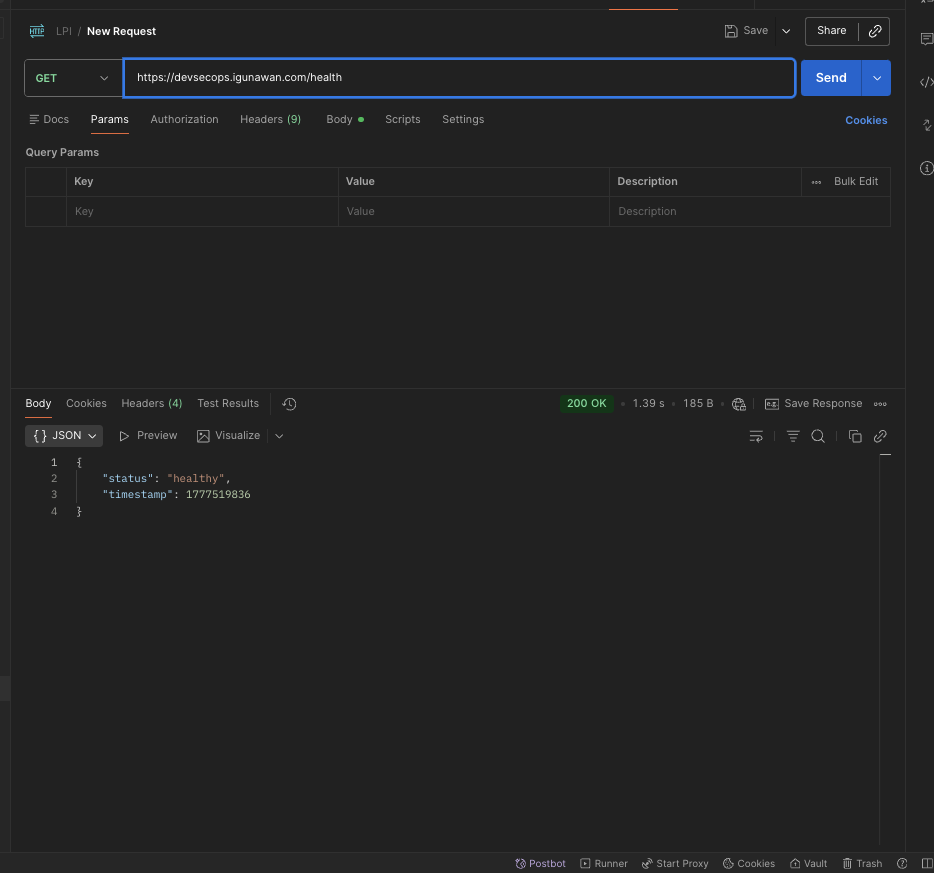

# DevSecOps Terraform

Terraform infrastructure for deploying applications on AWS: **VPC → ALB (HTTPS) → ECS Fargate**.

1. Github Terraform :  https://github.com/gunawan-d/devsecops-tf
2. Github Application : https://github.com/gunawan-d/apps-tf/tree/main
3. You can check the deployed application at: `https://devsecops.igunawan.com`




## 🔄 CI/CD Information

CI/CD pipeline is implemented using GitHub Actions for building and pushing Docker images to ECR, followed by AWS CodePipeline for deployment to ECS Fargate. 

Due to AWS account restrictions (Sandboxing) on new accounts affecting CodeBuild quotas, GitHub Actions serves as the primary CI provider to ensure reliable image building and pushing.


## 🚀 Quick Start

```bash
# Initialize Terraform
terraform init

# Set SSL certificate (if using HTTPS)
export TF_VAR_ssl_certificate_arn="arn:aws:acm:us-east-1:[ACCOUNT_ID]:certificate/..."

# Apply all modules
terraform apply

# OR apply specific module only
terraform apply -target=module.vpc
terraform apply -target=module.sg
terraform apply -target=module.alb
terraform apply -target=module.ecs
terraform apply -target=module.codebuild
terraform apply -target=module.codepipeline
```

Access: `https://devsecops.igunawan.com`

## 📦 Modules

| Module | Purpose | Apply Order |
|--------|---------|-------------|
| `modules/vpc` | VPC + 2 public + 2 private subnets | 1 (first) |
| `modules/security_group` | Firewall rules for ALB & ECS | 2 (depends on VPC) |
| `modules/alb` | Load balancer + HTTPS listener | 3 (depends on SG & VPC) |
| `modules/ecs` | Fargate cluster + service | 4 (last, depends on all) |

## ⚙️ Configuration

Edit `terraform.tfvars`:

```hcl
# VPC Network
vpc_cidr         = "10.0.0.0/16"
public_subnet    = "10.0.0.0/22"
public_subnet_b  = "10.0.4.0/22"
private_subnet   = "10.0.8.0/22"
private_subnet_b = "10.0.12.0/22"
az               = "us-east-1a"
az_2             = "us-east-1b"

# Application
ecs_container_image = "[ACCOUNT_ID].dkr.ecr.us-east-1.amazonaws.com/apps-tf:development"

# SSL (optional - leave null for HTTP only)
ssl_certificate_arn = null  # Set via env var or update this value
```

### Setting Variables via Environment Variables

Instead of editing `terraform.tfvars`, you can set variables via environment:

```bash
# Single variable
export TF_VAR_ssl_certificate_arn="arn:aws:acm:us-east-1:[ACCOUNT_ID]:certificate/..."

# Multiple variables
export TF_VAR_ecs_container_image="[ACCOUNT_ID].dkr.ecr.us-east-1.amazonaws.com/apps-tf:development"
export TF_VAR_vpc_cidr="10.0.0.0/16"

# Then apply
terraform apply
```

Environment variables override values in `terraform.tfvars`.

### Applying Specific Modules

Use `-target` flag to apply only specific modules (useful for incremental changes):

```bash
# Apply only VPC module
terraform apply -target=module.vpc

# Apply VPC and Security Groups (dependency order matters)
terraform apply -target=module.vpc -target=module.sg

# Apply only ECS (rebuild tasks without affecting ALB/VPC)
terraform apply -target=module.ecs

# Apply only ALB (add HTTPS listener without touching ECS)
terraform apply -target=module.alb
```

**Note:** `-target` breaks dependency tracking. Use with caution. For full deployments, run `terraform apply` without targets.

## 🔐 SSL Setup

### Method 1: Manual ACM + Terraform (Recommended for Cloudflare)

1. Request ACM certificate for `devsecops.igunawan.com` (DNS validation)
2. Add CNAME validation record in Cloudflare (**DNS Only**, grey cloud)
3. Wait for certificate status = **ISSUED**
4. Set certificate ARN:
   ```bash
   export TF_VAR_ssl_certificate_arn="arn:aws:acm:us-east-1:[ACCOUNT_ID]:certificate/..."
   ```
5. Apply ALB module:
   ```bash
   terraform apply -target=module.alb
   ```
6. HTTP automatically redirects to HTTPS

### Method 2: Terraform-managed ACM (Route53 only)

If using Route53 for DNS, you can manage ACM certificate entirely in Terraform (see ALB module README for full example).

## 📁 Project Structure

```
devsecops-tf/
├── main.tf               # Root module (calls all sub-modules)
├── variables.tf          # Variable definitions
├── outputs.tf            # Output values
├── terraform.tfvars      # Variable assignments (do not commit if sensitive)
├── .gitignore            # Ignore state/plan files
├── modules/
│   ├── vpc/             # Networking (VPC, subnets, IGW, NAT)
│   ├── security_group/  # ALB & ECS security groups
│   ├── alb/             # Load balancer + listeners
│   └── ecs/             # Fargate cluster + service
└── README.md            # This file
```

## 🆘 Troubleshooting

**ALB health checks failing?**  
Check target group health: `aws elbv2 describe-target-health --target-group-arn $(terraform output -raw target_group_arn)`

**ACM certificate stuck in pending?**  
Ensure CNAME record in Cloudflare is **DNS Only** (not Proxied). Wait 5-30 minutes for validation.

**ECS tasks not running?**  
Check CloudWatch logs: `/ecs/development/app-task`  
Verify ECR image exists and IAM roles have permissions.

**HTTPS not working?**  
Confirm ALB security group allows port 443 (included in module).

## 🧹 Cleanup

### Destroy all resources
```bash
terraform destroy
```

### Destroy specific module only
```bash
terraform destroy -target=module.ecs    # Delete ECS tasks first
terraform destroy -target=module.alb   # Then ALB
terraform destroy -target=module.sg    # Then security groups
terraform destroy -target=module.vpc   # Finally VPC
```

**Warning:** Order matters! Destroy ECS before ALB, ALB before SG, SG before VPC to avoid dependency errors.

## 📝 Variable Reference

See individual module READMEs for detailed variable documentation.

## 🔧 Common Commands

| Command | Description |
|---------|-------------|
| `terraform init` | Initialize Terraform configuration |
| `terraform plan` | Preview changes |
| `terraform apply` | Apply all changes |
| `terraform apply -target=module.X` | Apply only specific module |
| `terraform destroy` | Destroy all resources |
| `terraform state list` | List resources in state |
| `terraform output` | Show output values |