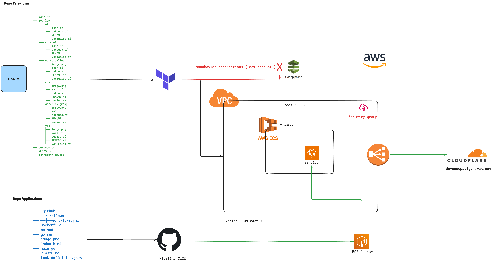

# DevSecOps Terraform

Terraform infrastructure for deploying applications on AWS: **VPC → ALB (HTTPS) → ECS Fargate** with full CI/CD pipeline.

1. GitHub Terraform: https://github.com/gunawan-d/devsecops-tf
2. GitHub Application: https://github.com/gunawan-d/apps-tf/tree/main
3. Live application: `https://devsecops.igunawan.com`


## Architecture


## 🔄 CI/CD Information

This project provides a complete CI/CD pipeline:

- **GitHub Actions** (primary): Builds and pushes Docker images to ECR. Used due to AWS CodeBuild service quotas on new accounts (sandboxing restrictions).
- **AWS CodePipeline** (optional): Orchestrates deployment from ECR to ECS Fargate using CodeBuild as build stage if desired.

Both approaches work; GitHub Actions is currently the primary method for reliable image builds.

## 🚀 Quick Start

```bash
# Initialize Terraform
terraform init

# Set required environment variables
export TF_VAR_github_oauth_token="your_github_pat"   # GitHub Personal Access Token
export TF_VAR_ssl_certificate_arn="arn:aws:acm:..." # Optional for HTTPS

# Apply all modules
terraform apply

# Or apply specific modules (in order)
terraform apply -target=module.vpc
terraform apply -target=module.sg
terraform apply -target=module.alb
terraform apply -target=module.ecs
terraform apply -target=module.codebuild   # Optional, if using CodeBuild
terraform apply -target=module.codepipeline # Optional, if using CodePipeline
```

Access the application at the ALB DNS output: `terraform output alb_dns_name`

## 📦 Modules

| Module | Purpose | Apply Order | Dependencies |
|--------|---------|-------------|--------------|
| `modules/vpc` | VPC + 2 public + 2 private subnets, NAT, IGW | 1 | None |
| `modules/security_group` | ALB & ECS security groups | 2 | VPC |
| `modules/alb` | Application Load Balancer + HTTP/HTTPS listeners | 3 | VPC, Security Groups |
| `modules/ecs` | ECS Fargate cluster, service, task definition, IAM roles | 4 | VPC, SG, ALB |
| `modules/codepipeline` | S3 bucket, IAM role, pipeline (optional) | 5 (optional) | VPC, SG, ALB, ECS, CodeBuild |
| `modules/codebuild` | CodeBuild project (optional) | 5 (optional) | None |

**Note:** CodeBuild and CodePipeline modules are optional. If using GitHub Actions for builds, you may skip these modules.

## ⚙️ Configuration

### terraform.tfvars Example

```hcl
#############################
# Global Settings
#############################
environment = "development"
tags = {
  ManagedBy   = "terraform"
  Environment = "development"
}

#############################
# VPC Network
#############################
vpc_cidr         = "10.0.0.0/16"
public_subnet    = "10.0.0.0/22"
public_subnet_b  = "10.0.4.0/22"
private_subnet   = "10.0.8.0/22"
private_subnet_b = "10.0.12.0/22"
# Availability Zones (az, az_2) are auto-detected if not provided

#############################
# Application (ECS)
#############################
ecs_cluster_name    = "app-cluster"
ecs_task_family     = "app-task"
ecs_service_name    = "app-service"
ecs_container_name  = "app"
ecs_container_image = "148963274465.dkr.ecr.us-east-1.amazonaws.com/apps-tf:latest"
ecs_container_port  = 8080
ecs_task_cpu        = "256"   # Valid: 256, 512, 1024, 2048
ecs_task_memory     = "512"   # Valid: 512, 1024, 2048, 4096, 8192, 16384
ecs_desired_count   = 2

#############################
# Load Balancer
#############################
app_port              = 8080
alb_name              = "app-alb"
target_group_name     = "app-tg"
target_group_port     = 8080
target_group_protocol = "HTTP"
health_check_path     = "/health"
health_check_matcher  = "200-399"
ssl_certificate_arn   = null  # Set to ACM ARN to enable HTTPS

#############################
# CodeBuild & CodePipeline (optional)
#############################
project_name       = "myapp"
build_timeout      = 60
build_compute_type = "BUILD_GENERAL1_SMALL"
build_image        = "aws/codebuild/standard:5.0"
image_repo_name    = "apps-tf"
image_tag          = "latest"
buildspec          = "buildspec.yml"   # Must exist in repository root
github_repository  = "gunawan-d/apps-tf"
github_branch      = "main"
# github_oauth_token: Set via environment variable only! (do not commit)
```

### Environment Variables (Recommended for Secrets)

Instead of editing `terraform.tfvars` for sensitive values, use environment variables:

```bash
export TF_VAR_github_oauth_token="ghp_xxxxxxxxxxxxxxxxxxxx"
export TF_VAR_ssl_certificate_arn="arn:aws:acm:..."
export TF_VAR_ecs_container_image="123456789012.dkr.ecr.us-east-1.amazonaws.com/repo:tag"
```

Environment variables override values in `terraform.tfvars`.

## 🔐 Security Best Practices

### GitHub Token
- **Never commit** `github_oauth_token` to version control.
- Always set via environment variable: `export TF_VAR_github_oauth_token="your_pat"`
- Rotate the token periodically and immediately if exposed.

### IAM Least Privilege
- CodeBuild and CodePipeline IAM policies are scoped to specific resources (S3 bucket, CodeBuild project, ECS service).
- ECS execution role uses AWS managed policy `AmazonECSTaskExecutionRolePolicy`.
- Additional permissions can be added via separate IAM policy attachments.

### Encryption
- S3 buckets use SSE-KMS encryption.
- CloudWatch Logs retain for 30 days.
- HTTPS is optional via ACM certificate; HTTP→HTTPS redirect enabled when SSL configured.

### Network Security
- ECS tasks run in private subnets with no public IP.
- ALB in public subnets with security groups restricting inbound to ports 80/443.
- ECS security group only allows traffic from ALB security group on `app_port`.

## 🏗️ Data Sources (Auto-Detection)

This configuration uses Terraform data sources to automatically detect:
- **AWS Account ID** (`data.aws_caller_identity.current.account_id`) - No need to manually provide.
- **AWS Region** (`data.aws_region.current.name`) - Inherited from provider configuration.
- **Availability Zones** (`data.aws_availability_zones.available.names`) - First two AZs are selected automatically; no need to set `az` or `az_2`.

Benefits: reduces configuration errors, ensures consistency across environments.

## 🏷️ Tagging Strategy

All resources inherit global tags from the `tags` variable (default: `ManagedBy = "terraform"`, `Environment = "development"`). Each module adds resource-specific `Name` tags and merges with global tags.

Example to override environment:

```hcl
environment = "staging"
tags = {
  ManagedBy   = "terraform"
  Environment = "staging"
  Owner       = "team-dev"
}
```

All resources (VPC, subnets, security groups, ALB, ECS cluster/service/tasks, IAM roles, S3 buckets, CodeBuild/CodePipeline) are tagged consistently.

## 🔐 SSL Setup

### Method 1: Manual ACM + Terraform (Cloudflare)

1. Request ACM certificate for your domain (DNS validation)
2. Add CNAME validation record in Cloudflare (**DNS Only**, grey cloud)
3. Wait for certificate status = **ISSUED**
4. Set certificate ARN via environment variable or `terraform.tfvars`:
   ```bash
   export TF_VAR_ssl_certificate_arn="arn:aws:acm:us-east-1:account:certificate/..."
   ```
5. Apply ALB: `terraform apply -target=module.alb`
6. HTTP automatically redirects to HTTPS (301)

### Method 2: Terraform-managed ACM (Route53 only)

If using Route53, manage ACM certificate entirely in Terraform. See ALB module README for details.

## 📁 Project Structure

```
devsecops-tf/
├── main.tf                # Root module (calls all sub-modules)
├── variables.tf           # Root variable definitions
├── outputs.tf             # Root output values
├── terraform.tfvars       # Variable assignments (example)
├── buildspec.yml          # CodeBuild build specification
├── .gitignore             # Ignores state/plan files
├── modules/
│   ├── vpc/               # Networking (VPC, subnets, IGW, NAT)
│   ├── security_group/    # ALB & ECS security groups
│   ├── alb/               # Load balancer + listeners + rules
│   ├── ecs/               # Fargate cluster + service + IAM
│   ├── codebuild/         # CodeBuild project (optional)
│   └── codepipeline/      # CodePipeline (optional)
└── README.md              # This file
```

## 🆘 Troubleshooting

**ALB health checks failing?**
Check target group health: `aws elbv2 describe-target-health --target-group-arn $(terraform output -raw target_group_arn)`

**ACM certificate stuck in pending?**
Ensure CNAME record in Cloudflare is **DNS Only** (not Proxied). Wait 5-30 minutes.

**ECS tasks not running?**
Check CloudWatch logs: `/ecs/development/app-task` or as tagged. Verify ECR image exists and IAM roles have permissions.

**HTTPS not working?**
Confirm ALB security group allows port 443 and certificate is ISSUED.

**CodeBuild quota exceeded?**
If your AWS account is restricted (Sandbox), disable CodeBuild/CodePipeline modules and use GitHub Actions instead. Update `image` and `tag` variables accordingly.

## 🧹 Cleanup

### Destroy all resources
```bash
terraform destroy
```

### Destroy specific modules (order matters)
```bash
terraform destroy -target=module.codepipeline  # If used
terraform destroy -target=module.codebuild    # If used
terraform destroy -target=module.ecs           # ECS tasks first
terraform destroy -target=module.alb           # Then ALB
terraform destroy -target=module.sg            # Then security groups
terraform destroy -target=module.vpc           # Finally VPC
```

**Warning:** Destroy in reverse apply order to avoid dependency errors.

## 📝 Variable Reference

See individual module READMEs (`modules/*/README.md`) for complete variable documentation.

## 🔧 Common Commands

| Command | Description |
|---------|-------------|
| `terraform init` | Initialize Terraform configuration |
| `terraform plan` | Preview changes |
| `terraform apply` | Apply all changes |
| `terraform apply -target=module.X` | Apply specific module |
| `terraform destroy` | Destroy all resources |
| `terraform state list` | List resources in state |
| `terraform output` | Show output values |
| `terraform fmt -recursive` | Format all code |
| `terraform validate` | Validate configuration |

## ✅ Validation & Type Safety

All variables include:
- **Type constraints** (string, number, list, map)
- **Validation rules** for CIDR blocks, port ranges, CPU/memory values
- **Descriptions** explaining purpose and allowed values

This prevents common misconfigurations early.

## 📚 Module Documentation

- [VPC Module](modules/vpc/README.md) — Network foundation
- [Security Group Module](modules/security_group/README.md) — Firewall rules
- [ALB Module](modules/alb/README.md) — Load balancer + HTTPS
- [ECS Module](modules/ecs/README.md) — Fargate compute
- [CodeBuild Module](modules/codebuild/README.md) — CI build project
- [CodePipeline Module](modules/codepipeline/README.md) — CD pipeline
