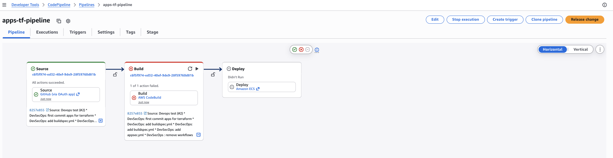

# AWS CodeBuild Module

## Known Issue: AWS Service Quota Restriction

By design, I have provided AWS CodeBuild and CodePipeline modules in Terraform.

However, my AWS account is affected by automatic restrictions (Sandboxing) with AccountLimitExceededException error (0 builds in queue).

As a solution, I have provided GitHub Actions as a backup CI provider to ensure the image is still built and pushed to ECR, so the deployment process to ECS continues to run automatically.

## Hybrid Solution

Replace CodeBuild with GitHub Actions (Quick Solution)
Use GitHub Actions to build Docker and push to ECR.

Flow: GitHub Actions (Build & Push) -> AWS CodePipeline (Source from ECR & Deploy to ECS).

